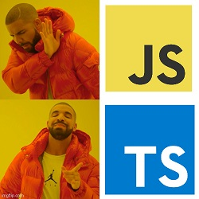

# My typescript examples

Typescript examples resolving LeetCode or HackerRank exercises
- Algorithms
  [Binary tree](https://github.com/trekhleb/javascript-algorithms/tree/master/src/data-structures/tree)
    - Breadth first value.
    - Depth First value.
- [LeetCode](https://leetcode.com)
  - Algorithms
    - Easy
      - [Add array form of integer](./src/leetCode/algorithms/easy/addToArrayFormOfIntegers.md)
      - [Add binary](./src/leetCode/algorithms/easy/addBinary.md)
      - [Integer to roman](https://leetcode.com/problems/integer-to-roman/)
      - [Plus one](./src/leetCode/algorithms/easy/plusOne.md)
    - Medium
      - [Add two numbers](./src/leetCode/algorithms/medium/addTwoNumbers.md)
      - [Multiply strings](https://leetcode.com/problems/multiply-strings/)
- [HackerRank](https://www.hackerrank.com)
  - Algorithms
    - Easy
      - [Compare de triplets](./src/hackerRank/algorithms/easy/compareTheTriplets.md)
      - [Diagonal difference](./src/hackerRank/algorithms/easy/diagonalDifference.md)
      - [Plus minus](./src/hackerRank/algorithms/easy/plusMinus.md)
      - [Repeated String](./src/hackerRank/algorithms/easy/repeatedString.md)
      - [Simple array sum](./src/hackerRank/algorithms/easy/simpleArraySum.md)
      - [Solve me first](./src/hackerRank/algorithms/easy/solveMeFirst.md)
      - [Staircase](./src/hackerRank/algorithms/easy/staircase.md)
      - [Birthday Cake Candles](./src/hackerRank/algorithms/easy/birthdayCakeCandles.md)
- Real code interviews
  - [Count dupes](./src/realCodeInterviews/countDupes.md)

## Install your environment

Install dependencies to run all commands:

```bash
npm i
```

## Check exercises

In order to check the source code of the exercises, you can use the following command:

```bash
npm tests
```

## Add new exercises

You could add a new exercise with him test only follow the same pattern:

```
myNewExerciseFile.ts        // Exercise source code
myNewExerciseFile.test.ts   // Exercise test code
```

In order to write your source code while test are running you could run:

```bash
npm run test:watch
```
