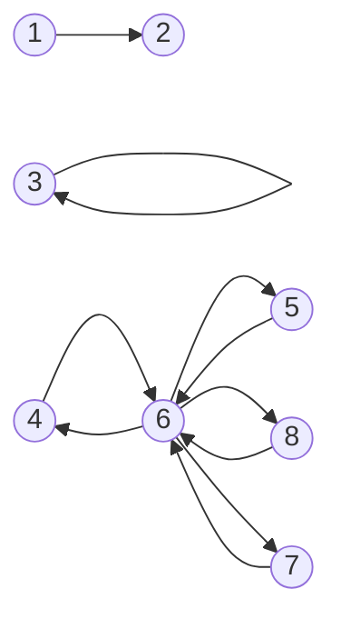

# Connected components count

Write a function, `connectedComponentsCount`, that takes in the adjacency list of an **undirected graph**. The function should return the number of connected components within the graph.

