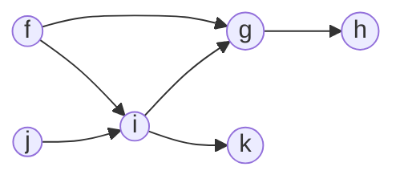

# Has path

Write a function, `hasPath`, that takes in an object representing the adjacency list of a directed acyclic graph and two nodes (src, dst). The function should return a boolean indicating whether or not there exists a directed path between the source and destination nodes.

Hey. This is our first graph problem, so you should be liberal with watching the Approach and Walkthrough. Be productive, not stubborn. -AZ

