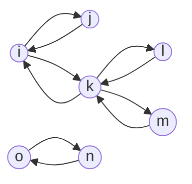

# Undirected path

Write a function, `undirectedPath`, that takes in an array of edges for an undirected graph and two nodes (nodeA, nodeB). The function should return a boolean indicating whether or not there exists a path between `nodeA` and `nodeB`.

