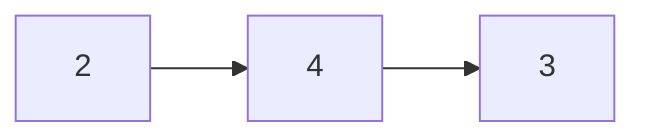
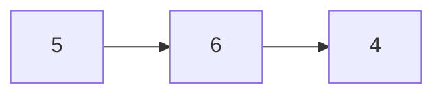
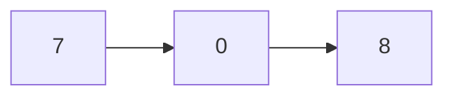

# Add Two Numbers

[Leet Code Link](https://leetcode.com/problems/add-two-numbers/)

You are given two non-empty linked lists representing two non-negative integers.

The digits are stored in reverse order, and each of their nodes contains a single digit.

Add the two numbers and return the sum as a linked list.

You may assume the two numbers do not contain any leading zero, except the number 0 itself.

**Example 1:**

Inputs:





Outputs:



```
Input: l1 = [2,4,3], l2 = [5,6,4]
Output: [7,0,8]
```

Explanation: 342 + 465 = 807.

**Example 2:**

```
Input: l1 = [0], l2 = [0]
Output: [0]
```

**Example 3:**

```
Input: l1 = [9,9,9,9,9,9,9], l2 = [9,9,9,9]
Output: [8,9,9,9,0,0,0,1]
```

**Solution**

[Source Code](./addTwoNumbers.ts)
[Tests Code](./addTwoNumbers.test.ts)
